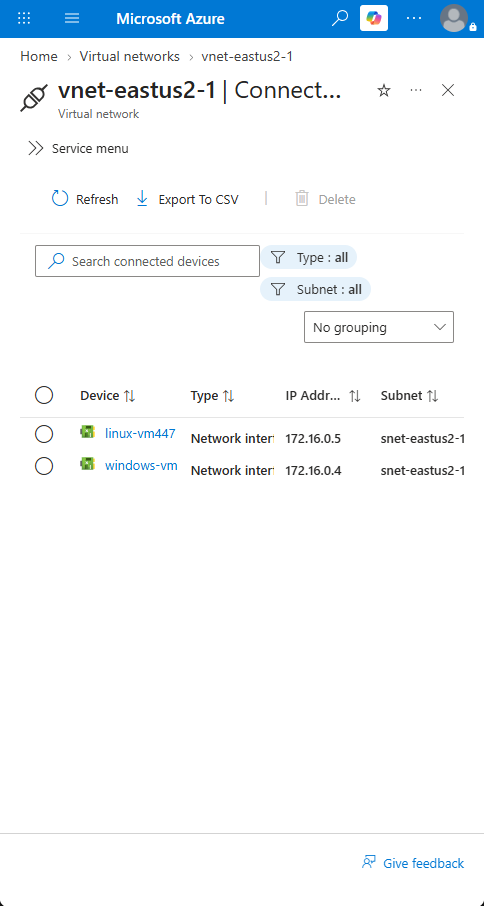
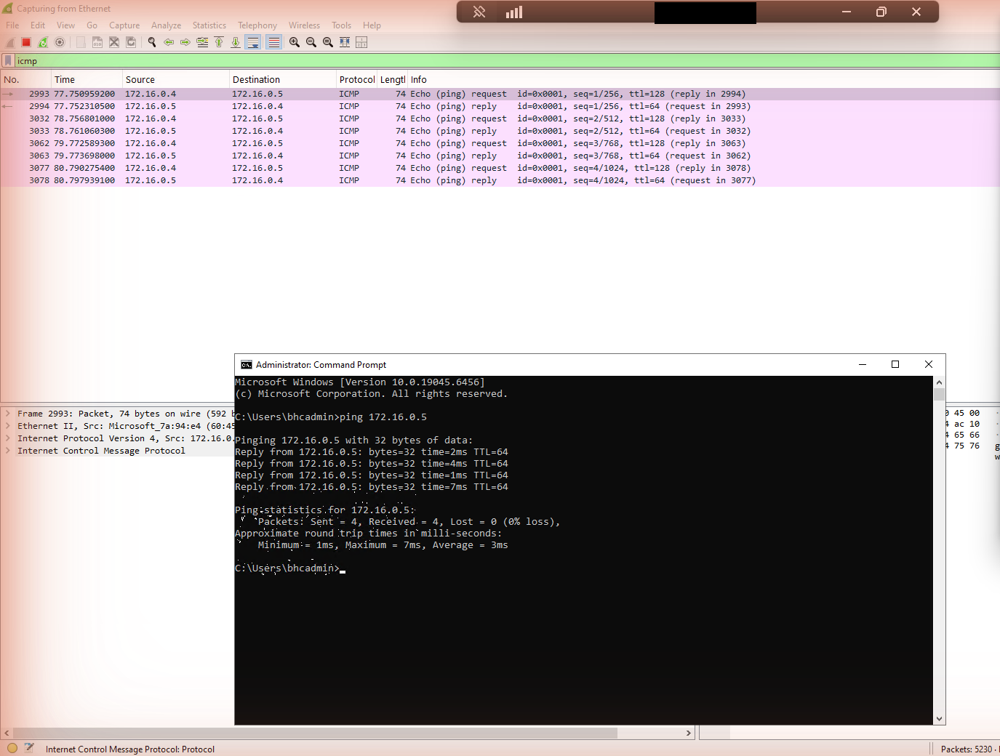
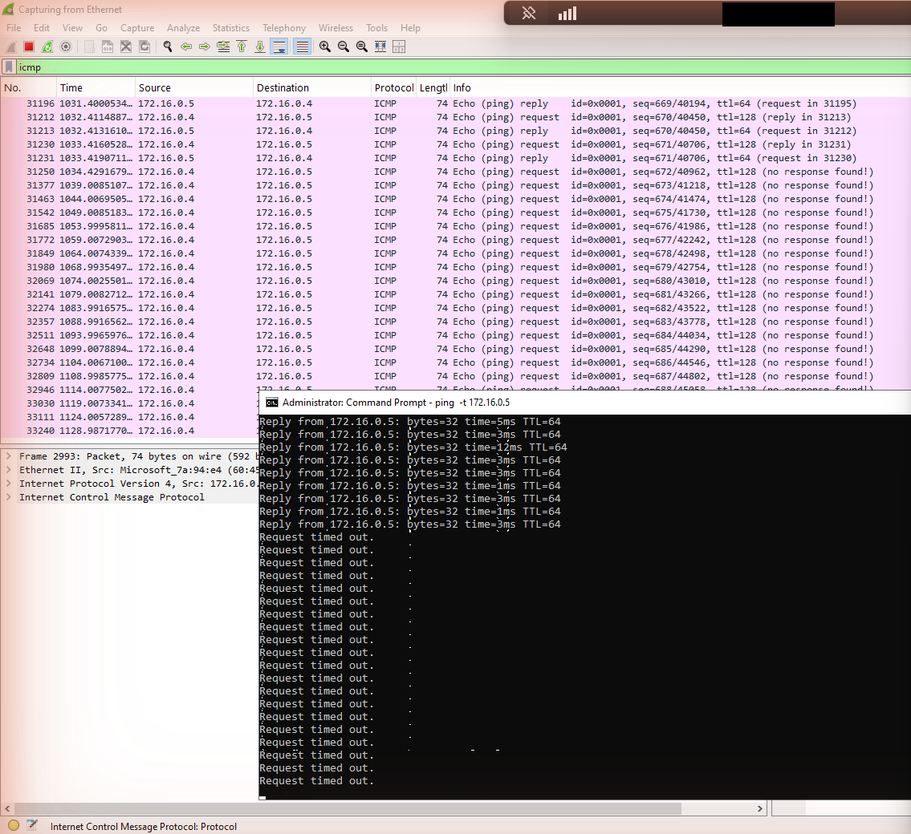
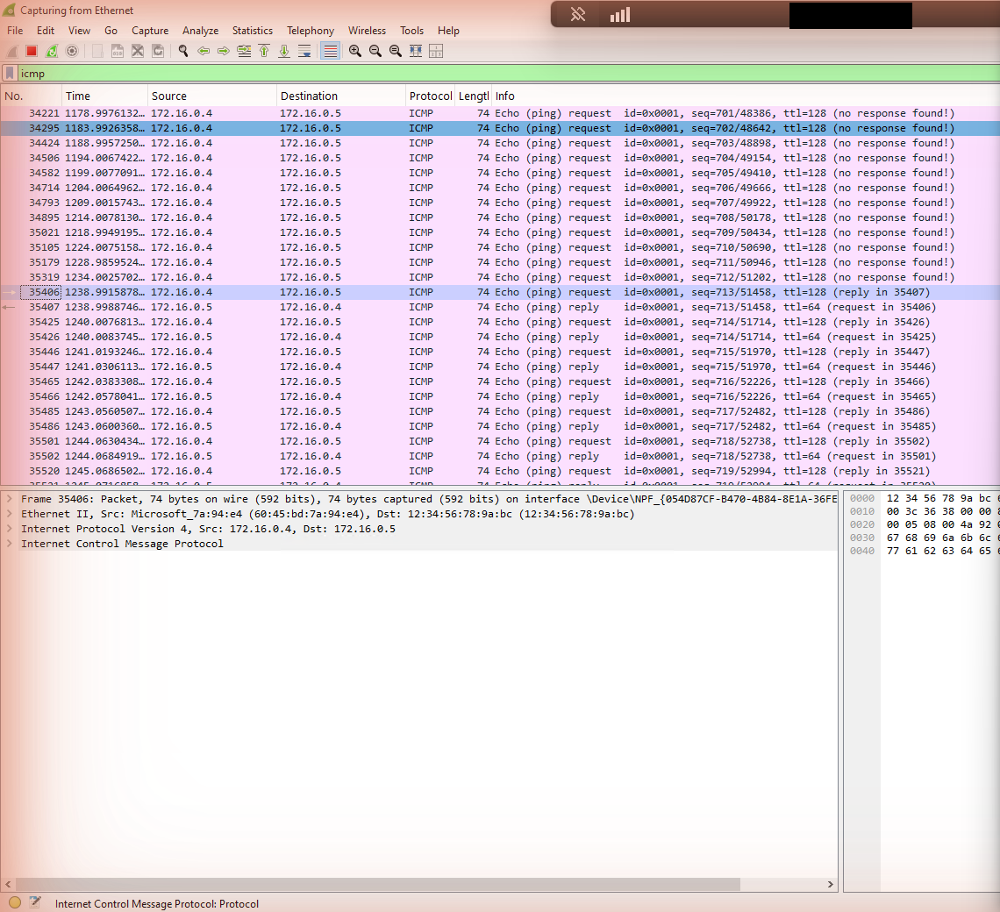
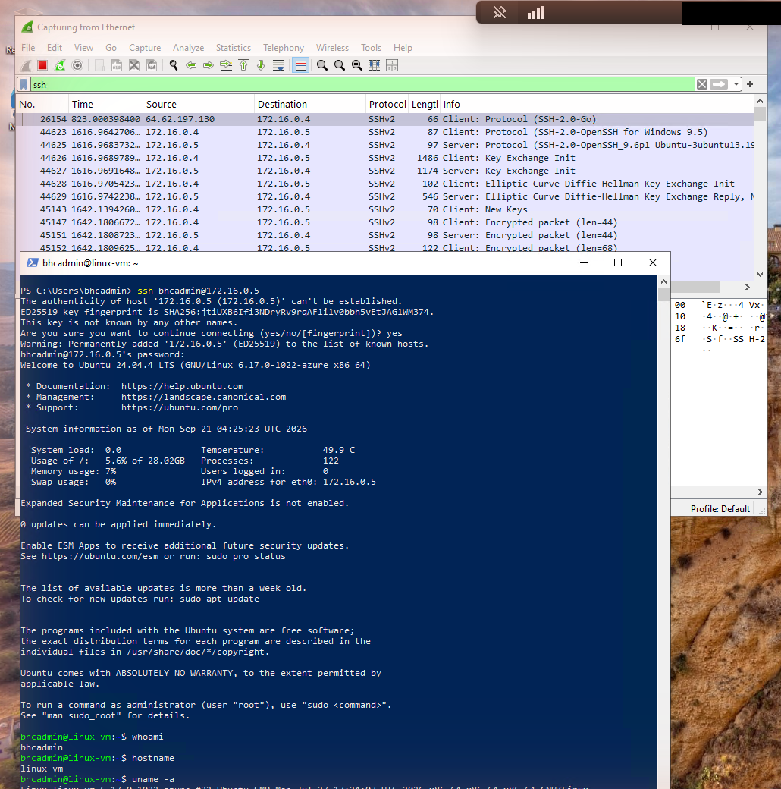
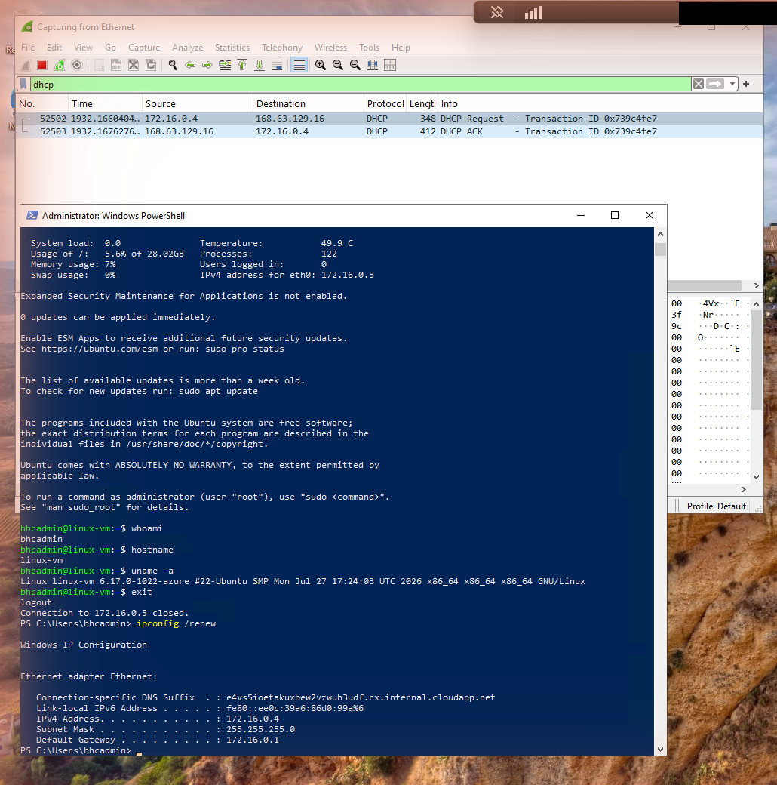
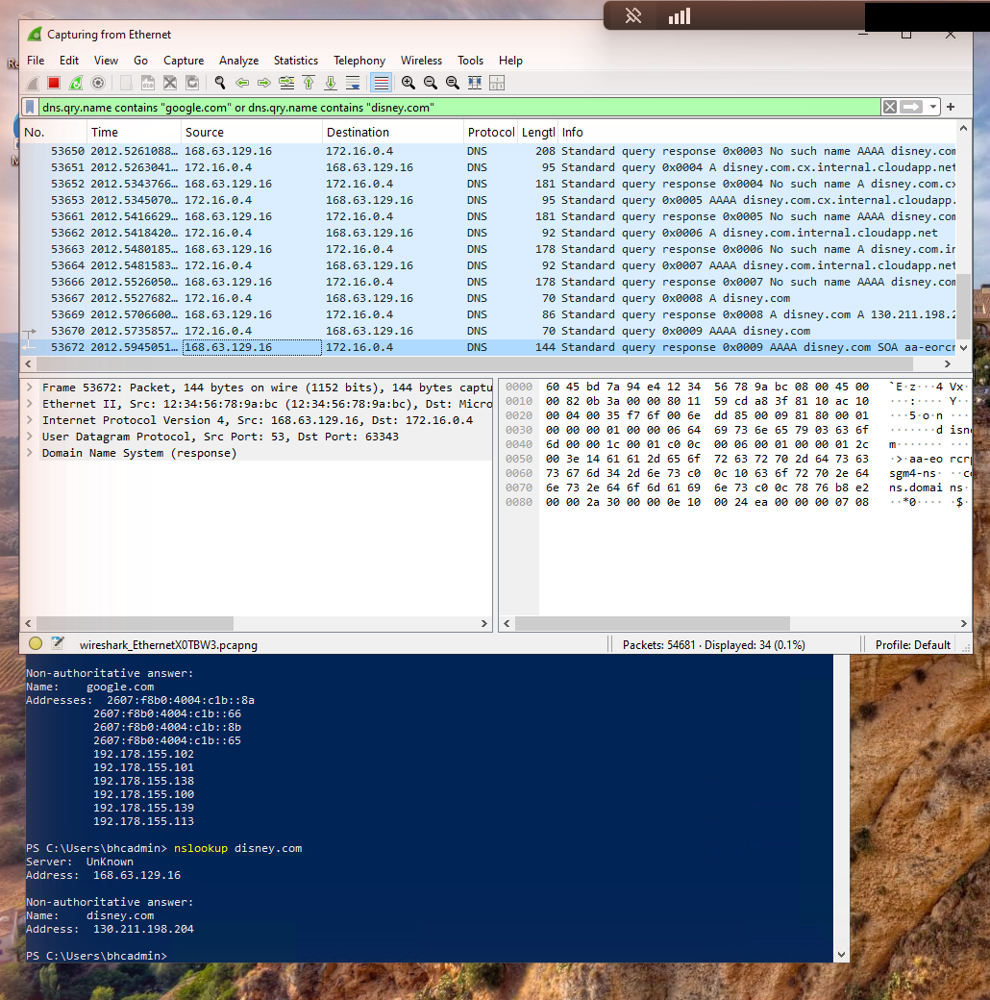
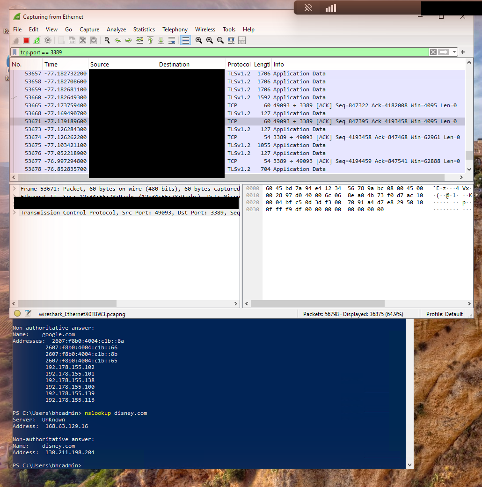
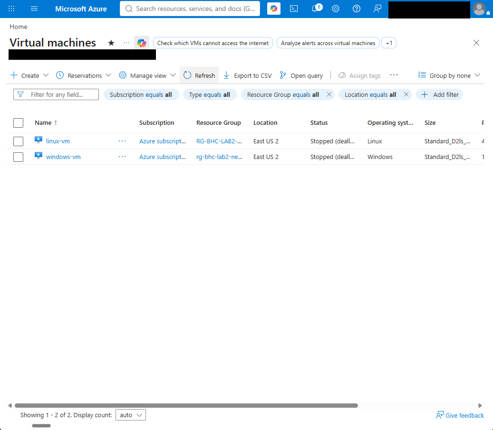

# Azure Cloud Fundamentals Lab 2

## Virtual machines, virtual networking, and packet analysis

This hands-on lab documents two virtual machines (Windows 10 and Ubuntu) built on one Azure virtual network, then a packet-capture walkthrough inside the Windows VM. I used Wireshark to watch ICMP, SSH, DHCP, DNS, and RDP traffic, and a Network Security Group (Azure's cloud firewall) to block and restore ping.

## What I completed

- Created the resource group `rg-bhc-lab2-network` in East US 2.
- Deployed `windows-vm` (Windows 10 Enterprise 22H2) and `linux-vm` (Ubuntu Server 24.04 LTS), both `Standard_D2ls_v6` (2 vCPU, 4 GiB).
- Put both VMs on the same virtual network and subnet: `vnet-eastus2-1` / `snet-eastus2-1` (172.16.0.0/24). `windows-vm` is 172.16.0.4 and `linux-vm` is 172.16.0.5.
- Connected to `windows-vm` with Remote Desktop and installed Wireshark 4.6.8 (with Npcap) inside it.
- Captured and filtered ICMP, SSH, DHCP, DNS, and RDP traffic.
- Blocked and restored inbound ICMP on the Linux VM with a Network Security Group rule.
- Stopped (deallocated) both VMs after the lab so compute billing stopped.

## Architecture

```text
Resource group: rg-bhc-lab2-network (East US 2)
  Virtual network: vnet-eastus2-1 (172.16.0.0/16)
    Subnet: snet-eastus2-1 (172.16.0.0/24)
      windows-vm  172.16.0.4   Windows 10, Wireshark, RDP in
      linux-vm    172.16.0.5   Ubuntu 24.04, SSH in, protected by linux-vm-nsg
```

## What each protocol looked like in Wireshark

| Protocol | What I did | What the capture showed |
|---|---|---|
| ICMP | `ping 172.16.0.5`, then `ping bluehippocyber.com` | 4 requests and 4 replies each time, 0% loss, 1 to 7 ms. TTL was 64 from the Ubuntu VM and 244 from the public site. |
| ICMP + firewall | Added NSG rule `Deny-ICMP-Inbound` (ICMPv4, Deny, priority 100), then changed it to Allow | Replies stopped and Wireshark flagged the requests "no response found!". Replies resumed as soon as the rule allowed ICMP again. |
| SSH | `ssh bhcadmin@172.16.0.5` from PowerShell | Full handshake visible (client and server banners, key exchange), then only "Encrypted packet" lines. |
| DHCP | `ipconfig /renew` | One DHCP Request and one DHCP ACK with Azure's virtual DHCP/DNS address, 168.63.129.16. |
| DNS | `nslookup google.com`, `nslookup disney.com` | A and AAAA queries over UDP port 53 to 168.63.129.16, plus "No such name" answers when Windows tried internal suffixes first. |
| RDP | Filter `tcp.port == 3389` | Non-stop TLS traffic, about 65% of every packet captured, because RDP streams the remote screen continuously. |

## Evidence highlights

### Two VMs on one virtual network



### Ping between the VMs, seen in Wireshark



### Firewall rule blocks the ping



### Rule changed to Allow and replies resume



### SSH into the Ubuntu VM



### DHCP renewal



### DNS lookups



### RDP traffic volume



### VMs stopped after the lab



The [`evidence`](evidence/) folder holds the full numbered walkthrough, from creating the resource group to stopping the VMs.

## Troubleshooting notes

- **Default VM size was unavailable.** `Standard_DS1_v2` returned "NotAvailableForSubscription" in East US 2.
- **Availability zones hid the small sizes.** With "Availability zone" selected, the B-series sizes showed as unsupported. Switching to "No infrastructure redundancy required" made them visible.
- **Quota error.** A B-series VM passed the size picker but failed validation with `QuotaExceeded`: the subscription's limit for that VM family in East US 2 was 0 vCPUs. I checked the Quotas page, found newer D-series families with 0 of 10 used, and deployed `Standard_D2ls_v6` instead.
- **The Linux wizard offers a new network by default.** The Networking tab lists `(new) vnet-eastus2-2` first and pre-selects a new subnet. I chose the existing `vnet-eastus2-1` and `snet-eastus2-1` so both VMs share one network.
- **A wrong image would have cost far more.** One image click picked Windows Server 2025, which the cost panel priced at about $1,227 per month. I caught it before creating the VM and switched to Ubuntu.

## Security observation

While capturing SSH traffic, Wireshark showed a packet from an outside address sending an "SSH-2.0-Go" greeting to the Windows VM's port 3389, less than an hour after the VM came online. That is an internet scanner probing an open Remote Desktop port. The lab opens RDP to the internet for a short exercise; in a real environment I would restrict RDP to known addresses, use Azure Bastion or a VPN, and use strong, unique passwords.

## Cost and cleanup

- Each VM was about $0.09 per hour while running (estimate about $87 per month with disk and public IP).
- After the lab I stopped (deallocated) both VMs, so compute billing stopped. The disks and public IPs still carry a small cost.
- **Status:** the resource group `rg-bhc-lab2-network` still exists. It will be deleted when the module calls for it, and this README will be updated with the deletion and final cost check.

## Skills demonstrated

- Azure resource groups, virtual networks, subnets, and private IP addressing
- Deploying Windows and Linux virtual machines and choosing VM sizes against quota and cost
- Network Security Groups: rule priority, allow and deny behavior, editing a live rule
- Remote access with RDP and SSH
- Packet capture and display filtering with Wireshark (ICMP, SSH, DHCP, DNS, RDP)
- Reading TTL, handshakes, and encrypted vs readable traffic
- Cost-conscious lab operation and evidence collection with sensitive account details masked

## Scope

This is a personal training lab and portfolio artifact. It demonstrates hands-on Azure networking fundamentals; it does not claim production deployment or client work.
